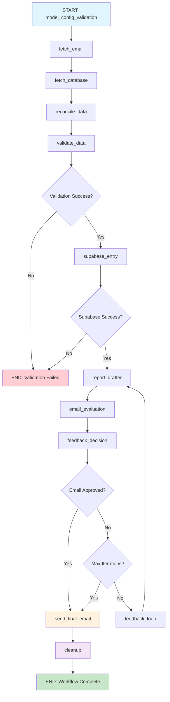

# LangGraph Workflow Flow Diagram

## Overview
This document provides a detailed flow diagram of the AgenticAI-based Fitness Reporting System using LangGraph for orchestration.

## Workflow Architecture



## Detailed Node Flow

### 0. **Gmail Token Check** 🔐
- **Purpose**: Check and refresh Gmail OAuth2 token if needed
- **Input**: token.json and credentials.json files
- **Output**: Valid Gmail token for API access
- **Next**: model_config_validation

### 1. **model_config_validation** 🔍
- **Purpose**: Validate that all required LLM models are properly configured
- **Input**: Environment variables for LLM_PROVIDER_1, LLM_MODEL_1, etc.
- **Output**: Validation result with success/failure status
- **Condition**: Must pass before proceeding to email fetching
- **Next**: fetch_email (if successful) or end_workflow (if failed)

### 2. **fetch_email** 📧
- **Purpose**: Fetch latest fitness email from Gmail using IMAP
- **Input**: Gmail credentials from environment variables
- **Output**: Email data in JSON format with fitness measurements
- **Next**: fetch_database

### 3. **fetch_database** 🗄️
- **Purpose**: Fetch latest database entry from SQLite Cloud
- **Input**: None (uses stored credentials)
- **Output**: Database data in JSON format
- **Next**: reconcile_data

### 4. **reconcile_data** 🔄
- **Purpose**: Compare email data with database using LLM
- **Input**: Email JSON + Database JSON
- **Output**: Reconciliation result with data comparison
- **Next**: validate_data

### 5. **validate_data** 🔍
- **Purpose**: Validate fitness data against historical trends using LLM
- **Input**: Email data (temporary file)
- **Output**: Validation result with status and confidence score
- **Condition**: Only runs if reconciliation was successful
- **Next**: supabase_entry (if validation successful) or end_workflow (if failed)

### 6. **supabase_entry** 📱
- **Purpose**: Enter validated data into Supabase via REST API
- **Input**: Email data
- **Output**: Supabase entry result with success/failure status
- **Condition**: Only runs if validation was successful
- **Next**: report_drafter (if entry successful) or end_workflow (if failed)

### 7. **report_drafter** 📝
- **Purpose**: Draft fitness report email using LLM
- **Input**: Supabase data + feedback (if iteration > 1)
- **Output**: Email body data with formatted content
- **Condition**: Only runs if Supabase entry was successful
- **Next**: email_evaluation

### 8. **email_evaluation** 🔍
- **Purpose**: Evaluate email body quality and provide feedback using LLM
- **Input**: Email body data from report_drafter
- **Output**: Evaluation result with approval status, score, and feedback
- **Condition**: Only runs if report_drafter was successful
- **Next**: feedback_decision

### 9. **feedback_decision** 🤔
- **Purpose**: Decide whether to continue feedback loop or send email
- **Input**: Email evaluation result + iteration count
- **Logic**:
  - If email approved → send_final_email
  - If max iterations (3) reached → send_final_email
  - Otherwise → feedback_loop
- **Next**: Conditional based on decision

### 10. **feedback_loop** 🔄
- **Purpose**: Update feedback and iteration count for next iteration
- **Input**: Email evaluation result
- **Output**: Updated state with feedback and incremented iteration
- **Next**: report_drafter (restart drafting with feedback)

### 11. **send_final_email** 📤
- **Purpose**: Send the approved email using Final Email Agent
- **Input**: Email body data from report_drafter
- **Output**: Email sending result
- **Features**: 
  - Excel attachment with all historical data from Supabase
  - Push notification after successful send
  - Gmail OAuth2.0 integration
- **Next**: cleanup

### 12. **cleanup** 🧹
- **Purpose**: Clean up browser sessions and system resources
- **Input**: None
- **Output**: Cleanup result
- **Next**: end_workflow

### 13. **end_workflow** 🏁
- **Purpose**: Workflow termination
- **Input**: Final state
- **Output**: Complete workflow result

## State Management

### WorkflowState Structure
```python
class WorkflowState(TypedDict):
    model_config_validation_result: Dict[str, Any]  # Model configuration validation
    email_data: Dict[str, Any]                      # Email fetching result
    database_data: Dict[str, Any]                   # Database fetching result
    reconciliation_result: Dict[str, Any]           # Data reconciliation result
    validation_result: Dict[str, Any]               # Data validation result
    supabase_result: Dict[str, Any]                 # Supabase entry result
    report_drafter_result: Dict[str, Any]           # Report drafting result
    email_evaluation_result: Dict[str, Any]         # Email evaluation result
    feedback: str                                   # Feedback for iterations
    iteration_count: int                            # Current iteration (1-3)
    max_iterations: int                             # Maximum iterations (3)
    final_email_sent: bool                          # Email sending status
    cleanup_result: Dict[str, Any]                  # Cleanup result
    error: str                                      # Error messages
    timestamp: str                                  # Workflow timestamp
```

## Conditional Logic

### Model Configuration Validation Check
```python
if not result.get('success'):
    # Skip to end - model configuration failed
    return "end_workflow"
else:
    # Continue with email fetching
    return "fetch_email"
```

### Validation Success Check
```python
if validation_result.get('validation_result', {}).get('validation_status') == 'Validation Success':
    # Continue with Supabase entry
    return "supabase_entry"
else:
    # Skip to end - validation failed
    return "end_workflow"
```

### Email Approval Logic
```python
if email_evaluation_result.get('approved', False):
    # Email approved - send it
    return "send_final_email"
elif iteration_count >= max_iterations:
    # Max iterations reached - force send
    return "send_final_email"
else:
    # Continue feedback loop
    return "feedback_loop"
```

## Error Handling

### Graceful Degradation
- **Model configuration failure**: Workflow terminates immediately
- **Missing data**: Workflow continues with available data
- **API failures**: Error messages captured in state
- **Validation failures**: Workflow ends gracefully
- **Email failures**: Error logged, cleanup still runs

### State Persistence
- **Partial results**: Stored in state for debugging
- **Error messages**: Captured in state.error field
- **Timestamps**: Tracked for monitoring

## Performance Characteristics

### Execution Flow
1. **Sequential execution** for data fetching and validation
2. **Conditional branching** based on validation results
3. **Iterative feedback loop** for email quality improvement (max 3 iterations)
4. **Parallel processing** within individual agents

### Time Estimates
- **Gmail token check**: ~2-5 seconds
- **Model configuration validation**: ~1-3 seconds
- **Email fetching**: ~5-10 seconds
- **Database fetching**: ~2-5 seconds
- **Data reconciliation**: ~10-15 seconds
- **Validation**: ~5-10 seconds
- **Supabase entry**: ~10-20 seconds
- **Report drafting**: ~15-30 seconds
- **Email evaluation**: ~5-10 seconds
- **Feedback loop**: Variable (1-3 iterations)
- **Email sending**: ~5-10 seconds
- **Cleanup**: ~2-5 seconds

**Total estimated time**: 2-5 minutes (depending on iterations)

## Monitoring and Observability

### LangSmith Integration
- **Project**: Charles-Fitness-report
- **Tracing**: V2 enabled for all operations
- **Endpoint**: https://api.smith.langchain.com
- **Dashboard**: https://smith.langchain.com/

### Logging Points
- **Node entry/exit**: Each node logs start/completion
- **Conditional decisions**: Decision points logged
- **Error conditions**: All errors captured and logged
- **Performance metrics**: Execution times tracked

### State Inspection
- **Intermediate results**: Available at each step
- **Error propagation**: Errors bubble up through state
- **Iteration tracking**: Feedback loop progress monitored

## Key Features

### 🔐 **Gmail Token Management**
- **OAuth2.0 integration** with automatic token refresh
- **Scope verification** for Gmail API access
- **Credential validation** before workflow execution
- **Token expiration handling** with automatic refresh

### 🔍 **Model Configuration Validation**
- **Multi-model setup** validation (OpenAI, Anthropic, Google)
- **Environment variable checking** for all required models
- **Early termination** if configuration is invalid
- **Pushover notifications** for configuration issues

### 🔄 **Feedback Loop System**
- **Maximum 3 iterations** for email quality improvement
- **LLM-based evaluation** of email content
- **Structured feedback** for iterative improvement
- **Automatic approval** after max iterations

### 📊 **Data Validation**
- **Historical trend analysis** using LLM
- **Confidence scoring** for validation decisions
- **Pushover notifications** for validation results
- **Temporary file management** for data processing

### 📤 **Email System**
- **Excel attachment** with complete historical data from Supabase
- **Push notifications** after successful sending
- **Gmail OAuth2.0** integration
- **Professional formatting** with LLM assistance

### 🧹 **Resource Management**
- **Automatic cleanup** of browser sessions
- **Temporary file removal** after processing
- **Memory management** for long-running workflows
- **Error recovery** and graceful degradation

## Workflow Variants

### Early Termination Paths
1. **Model configuration fails** → End immediately
2. **Validation fails** → End with error
3. **Supabase entry fails** → End with error
4. **Report drafting fails** → End with error

### Success Paths
1. **Email approved on first try** → Send immediately
2. **Email approved after feedback** → Send after iterations
3. **Email forced after max iterations** → Send with current version

### Error Recovery
- **Network issues**: Retry logic in individual agents
- **API failures**: Graceful degradation with error messages
- **Resource issues**: Cleanup ensures system stability
- **Token expiration**: Automatic refresh and retry 